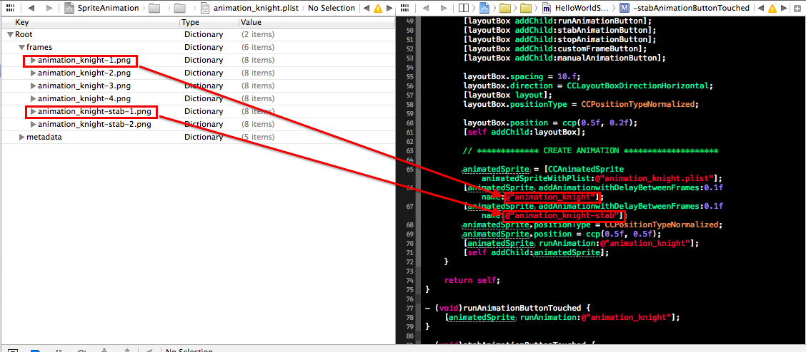

# The old way

Creating an animation for a CCSprite can be a repetitive task. Mostly you will create a CCSprite subclass for each animated object in your game. If you have lots of animations you will end up with a lot of boilerplate-code looking somewhat similar to this:

    [[CCSpriteFrameCache sharedSpriteFrameCache] addSpriteFramesWithFile: @"animation_knight.plist"];
    // ************* RUNNING ANIMATION ********************
    animationFramesRun = [NSMutableArray array];
    for(int i = 1; i <= 4; ++i)
    {
    	[animationFramesRun addObject:
            [[CCSpriteFrameCache sharedSpriteFrameCache] spriteFrameByName: [NSString stringWithFormat:@"animation_knight-%d.png", i]]];
    }
    //Create an animation from the set of frames you created earlier
    CCAnimation *running = [CCAnimation animationWithSpriteFrames: animationFramesRun delay:0.1f];
    //Create an action with the animation that can then be assigned to a sprite
    run = [CCRepeatForever actionWithAction: [CCAnimate actionWithAnimation:running]];

You load a Spritesheet to the CCSpriteFrameCache, you add the single images to an array from which you generate a CCAnimation action. Finally you wrap the CCAnimation action into a CCRepeatForever action and run it. And you write this code for every single animation in your game.

# Using CCAnimatedSprite

CCAnimatedSprite is here to help - and eliminate all that duplicate code from your game.

Here is how to use it:

    // 1.) initialize a CCAnimatedSprite with a Plist that contains your animation frames (generated by Zwoptex or Texture Packer
    CCAnimatedSprite *animatedSprite = [CCAnimatedSprite animatedSpriteWithPlist:@"animation_knight.plist"];
    // 2.) create an animation (use the animation name, that is used for the frames in your Spritesheet)
    [animatedSprite addAnimationwithDelayBetweenFrames:0.1f name:@"animation_knight"];
    // 3.) run the animation, referring it by name
    [animatedSprite runAnimation:@"animation_knight"];

You only have to be aware of using the same name as you used in your plist for the frame names. If your animation is called *animation_knight* your frames in the .plist need to be called *animation_knight-1.png*, *animation_knight-2.png* and so forth:

You can download this class for:

*   [Kobold2D 2.x](https://github.com/MakeSchool/CCAnimatedSprite/archive/v1.0-kobold2D.zip)
*   [cocos2d 3.x](https://github.com/MakeSchool/CCAnimatedSprite/archive/v1.0.zip)

You can also take a look at the [GitHub repository](https://github.com/MakeSchool/CCAnimatedSprite) that has an extensive documentation and an example project for cocos2d 3.0.
