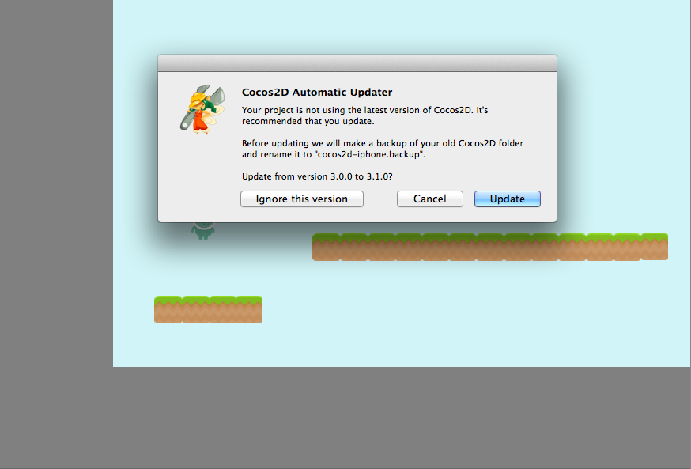
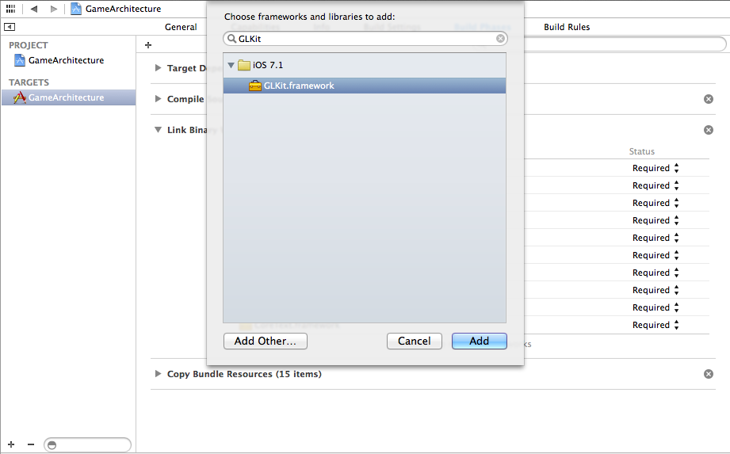
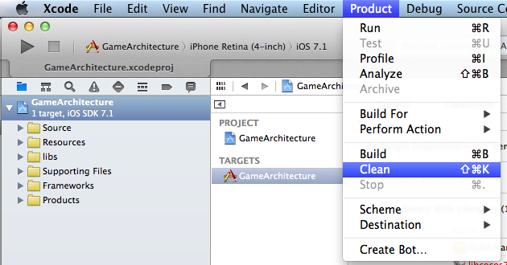

*Note: this is no longer the latest version of SpriteBuilder, please check our newer tutorials for updates*

Yesterday the SpriteBuilder release candidate for version 1.1 has been uploaded to the Mac App Store and has been made [available for download](http://forum.spritebuilder.com/t/spritebuilder-1-1-0-rc-available/1225) (for those of you who cannot wait for Apple to approve the update). SpriteBuilder 1.1 comes bundled with a new version of Cocos2D: 3.1.

The most interesting new features:

**SpriteBuilder 1.1:**

*   Automatically updates the version of Cocos2D in your projects
*   Adds support for complex polygons in physics
*   Adds support for physics joints and springs
*   Adds grids and snapping and other improvements to the stage editor

**Cocos2D 3.1**

*   Adds an entirely new **renderer** (that supports automatic batching)

We will be updating our tutorials &amp; [the documentation](https://www.makeschool.com/docs) to use and discuss all of these interesting new features shortly.

Today I want to show you how to update your existing SpriteBuilder app to version 1.1 and give a short preview of the new renderer in Cocos2D 3.1. The new renderer (amongst many important other changes) supports automatic batching. Automatic batching means that Cocos2D will automatically render all sprites with the same texture at once - formerly you needed to use a *CCSpriteBatchNode* to achieve that. You will be able to improve the performance of your game, simply by updating to Cocos2D 3.1.

## Updating an existing SpriteBuilder project to v1.1

Luckily this has become very easy with the latest version of SpriteBuilder. After you have downloaded SpriteBuilder 1.1 you can open any of your SpriteBuilder 1.0 projects. SpriteBuilder will automatically detect that you are not using the latest version of Cocos2D and suggest to update:

After selecting the *Update* button, the new version of Cocos2D will be added to your project!

Cocos2D 3.1 uses an additional Apple Framework: *GLKit*. In order for your project to run with Cocos2D 3.1 you need to add the *GLKit* framework. Select your *Target* and open the *Build Phases* tab. In the section *Link Binary with Libraries* select the + and add select *GLKit* from the list of frameworks:

After adding the framework you should clean your project to ensure that the Cocos2D library gets compiled from scratch:

**Now you should be able to run your game with Cocos2D 3.1!**

## Preview of the new renderer

I have used a very simple project to take a look at the output of the new renderer. Here is the simple project run with **Cocos2D 3.0:**

On the bottom left you can see the total amount of draw calls per frame: **19**. I have 19 objects on the screen and all of them are being rendered separately because I'm not using a *CCSpriteBatchNode*.

Now let's take a look at the same project after updating to SpriteBuilder 1.1 and thus **Cocos2D 3.1**:

Wow! Using the new renderer of Cocos2D 3.1 we are down to **5 draw calls** from 19. Instead of having one draw call per Sprite we are now having one draw call per texture. We can easily improve this even further by using SpriteBuilder's [Smart Spritesheets](https://www.makeschool.com/docs/#!/cocos2d/1.1/assets-spritebuilder). Smart Spritesheets will create on single large texture out of different assets used in SpriteBuilder. When we use a Smart Spritesheet for the example above and pack all textures into it, we end up with this result:

We are now down to **2 draw calls**! And one of them is actually used for the texture of the font in the bottom left corner. The game itself is being rendered in only **1 draw call**, down from 18 in the Cocos2D 3.0 version - simply amazing. Using Smart Spritesheets and Cocos2D 3.1 many scenes in all kinds of games will experience a performance boost!

Stay tuned for more tutorials on these amazing tools!
