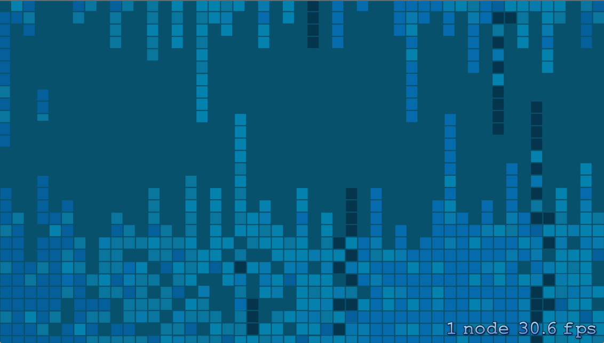

In this tutorial, you will learn to develop Conway’s Game of Life using the new iOS programming language, Swift, and the SpriteKit game engine. This is a Swift version of the Game of Life tutorial, which can be found at [https://www.makegameswith.us/curriculum/game-of-life-spritebuilder/](https://www.makegameswith.us/curriculum/game-of-life-spritebuilder/). If you are unfamiliar with the game check out [the Wikipedia article](http://en.wikipedia.org/wiki/Conway%27s_Game_of_Life) to learn more.

## Set up the project

First, setup a new Xcode 6 project, by going to File —&gt; New Project —&gt; iOS Application —&gt; Game. Make sure you set the “Language” to “Swift,” the “Game Technology” to “SpriteKit,” and “Devices” to “iPhone,” then create the project. *(While the original Objective-C tutorial provides a screen resolution independent user interface, for simplicity we will only be developing for a single platform in this tutorial, the iPhone.)*

First things first, change the default orientation to Landscape by clicking on the project file and under "Deployment Info" on the "General" tab, uncheck the Portrait option on "Device Orientation" and make sure the landscape options are checked instead.

Run the project to make sure you don't get any compiler errors.

Now open GameScene.sks, and go to View —&gt; Utilities —&gt; “Show SKNode Inspector” to edit the properties of the scene. Set the size to X:568, Y:320, so that the scene fits perfectly on an iPhone 5 device. Save the file.

##

## Add the static user interface

Get started by downloading our [art pack](https://s3.amazonaws.com/mgwu-misc/GameOfLife+SpriteBuilder+Tutorial/GameOfLifeAssets.zip) for this game.

After you unpacked it, drag the *GameOfLifeAssets* folder into your Xcode project onto the left panel to add the resources to your project. Make sure you check “Add to targets.”

Now open GameScene.swift. This is where the bulk of your code will go. Notice that there is only one file per class, as opposed to Objective-C which requires a .h and a .m file for each.

Delete the bodies of the *didMoveToView* and *touchesBegan* methods, so you can start from an empty scene.

Define a few constants at the class scope (add these outside any of the methods, but after the line “class GameScene: SKScene {“ )

    let _gridWidth = 400
    let _gridHeight = 300
    let _numRows = 8
    let _numCols = 10
    let _gridLowerLeftCorner:CGPoint = CGPoint(x: 158, y: 10)

*let* is the syntax for creating a constant. Notice we don’t need to declare a data type for each variable, as they can be inferred from the initial value. We also don’t need semicolons. You may explicitly provide the type of a variable by adding it with a colon after the name of the variable, as we did with *_gridLowerLeftCorner*

Add a background image to the screen — this will be a SKSpriteNode. Add this code to the top of *didMoveToView*:

    let background = SKSpriteNode(imageNamed: "background.png")
    background.anchorPoint = CGPoint(x: 0, y: 0)
    background.size = self.size
    background.zPosition = -2
    self.addChild(background)

Note how Swift uses *dot syntax* to access properties and call methods of objects. Whereas Objective-C would say *[self addChild:background],* in Swift we say *self.addChild(background)*

Also note how we initialize a new SKSpriteNode simply by writing *SKSpriteNode(imageNamed: “background.png”),* rather than the Objective-C *[SKSpriteNode spriteNodeWithImageNamed:”background.png”].* You can follow this pattern in general to access Objective-C APIs in Swift (read more: [Interacting With Objective-C APIs](https://developer.apple.com/library/prerelease/ios/documentation/Swift/Conceptual/BuildingCocoaApps/InteractingWithObjective-CAPIs.html)).

If you run the project on an iPhone 5 simulator, you should see:

Now add another background image to appear behind the grid. Add this code to *didMoveToView:*

    let gridBackground = SKSpriteNode(imageNamed: "grid.png")
    gridBackground.size = CGSize(width: _gridWidth, height: _gridHeight)
    gridBackground.zPosition = -1
    gridBackground.anchorPoint = CGPoint(x:0, y:0)
    gridBackground.position = _gridLowerLeftCorner
    self.addChild(gridBackground)

Run the project to see:

We’re going to finish up the user interface by adding a few more sprites and some labels on the left side of the screen.

First, define these constants and variables in the class, where we defined the constants earlier:

    let _populationLabel:SKLabelNode = SKLabelNode(text: "Population")
    let _generationLabel:SKLabelNode = SKLabelNode(text: "Generation")
    var _populationValueLabel:SKLabelNode = SKLabelNode(text: "0")
    var _generationValueLabel:SKLabelNode = SKLabelNode(text: “0")
    var _playButton:SKSpriteNode = SKSpriteNode(imageNamed:"play.png")
    var _pauseButton:SKSpriteNode = SKSpriteNode(imageNamed:"pause.png")

Now add to *didMoveToView:*

    _playButton.position = CGPoint(x: 79, y: 290)
    _playButton.setScale(0.5)
    self.addChild(_playButton)
    _pauseButton.position = CGPoint(x: 79, y: 250)
    _pauseButton.setScale(0.5)
    self.addChild(_pauseButton)
    // add a balloon background for the stats
    let balloon = SKSpriteNode(imageNamed: "balloon.png")
    balloon.position = CGPoint(x: 79, y: 170)
    balloon.setScale(0.5)
    self.addChild(balloon)
    // add a microscope image as a decoration
    let microscope = SKSpriteNode(imageNamed: "microscope.png")
    microscope.position = CGPoint(x: 79, y: 70)
    microscope.setScale(0.4)
    self.addChild(microscope)
    // dark green labels to keep track of number of living tiles
    // and number of steps the simulation has gone through
    _populationLabel.position = CGPoint(x: 79, y: 190)
    _populationLabel.fontName = "Courier"
    _populationLabel.fontSize = 12
    _populationLabel.fontColor = UIColor(red: 0, green: 0.2, blue: 0, alpha: 1)
    self.addChild(_populationLabel)
    _generationLabel.position = CGPoint(x: 79, y: 160)
    _generationLabel.fontName = "Courier"
    _generationLabel.fontSize = 12
    _generationLabel.fontColor = UIColor(red: 0, green: 0.2, blue: 0, alpha: 1)
    self.addChild(_generationLabel)
    _populationValueLabel.position = CGPoint(x: 79, y: 175)
    _populationValueLabel.fontName = "Courier"
    _populationValueLabel.fontSize = 12
    _populationValueLabel.fontColor = UIColor(red: 0, green: 0.2, blue: 0, alpha: 1)
    self.addChild(_populationValueLabel)
    _generationValueLabel.position = CGPoint(x: 79, y: 145)
    _generationValueLabel.fontName = "Courier"
    _generationValueLabel.fontSize = 12
    _generationValueLabel.fontColor = UIColor(red: 0, green: 0.2, blue: 0, alpha: 1)
    self.addChild(_generationValueLabel)

Your project should now display a full user interface, although you can’t interact with it yet:

## Add the creature tiles

We need to store a grid of tiles to represent the creatures in our Game of Life. To do so, store the tiles in a 2-dimensional array of SKSpriteNodes. Define a new *_tiles* variable in the class (directly beneath the constants we defined earlier). Also add a variable for the margin between tiles.

    var _tiles:SKSpriteNode[][] = []
    var _margin = 4

Notice the the simplified syntax for initializing a 2-dimensional array.

Now, before we can add each of the tiles we need to know at what position to add them, and the dimensions of each tile. First lets calculate how big each tile should be, based on the total grid size and the number of tiles in the grid. Define this new method inside the GameScene class:

    func calculateTileSize() -> CGSize
    {
        let tileWidth = _gridWidth / _numCols - _margin
        let tileHeight = _gridHeight / _numRows - _margin
        return CGSize(width: tileWidth, height: tileHeight)
    }

We declare new methods with *func,* the parameters are specified inside the pair of parentheses, and the return type is specified after the -&gt; *return arrow.*

Now lets add a function which tells us the x-y coordinates of a tile based on its row and column. We can use this to position the tiles on the screen. Add this method to the class:

    func getTilePosition(row r:Int, column c:Int) -> CGPoint
    {
        let tileSize = calculateTileSize()
        let x = Int(_gridLowerLeftCorner.x) + _margin + (c * (Int(tileSize.width) + _margin))
        let y = Int(_gridLowerLeftCorner.y) + _margin + (r * (Int(tileSize.height) + _margin))
        return CGPoint(x: x, y: y)
    }

**Important:** Notice that we can’t directly perform operations (such as addition) between an Int and a CGFloat in Swift — in order to do so, we must explicitly **cast** one datatype so that it matches the other, using Int( … ) or CGFloat( … )

Also notice how we specify parameters in Swift. In this case, *r* and *c* are the parameters, which are of type Int. We also chose to provide human-readable names “row” and “column” that will appear in code autocompletion and make the method signature easier to read and understand.

Now lets add two for-loops to initialize the 2-D tiles array and add each of the 80 tiles to the scene in the appropriate locations. Add this code to *didMoveToView:*

    // initialize the 2d array of tiles
    let tileSize = calculateTileSize()
    for r in 0.._numRows {
        var tileRow:SKSpriteNode[] = []
        for c in 0.._numCols {
            let tile = SKSpriteNode(imageNamed: "bubble.png")
            tile.size = CGSize(width: tileSize.width, height: tileSize.height)
            tile.anchorPoint = CGPoint(x: 0, y: 0)
            tile.position = getTilePosition(row: r, column: c)
            self.addChild(tile)
            tileRow.append(tile)
        }
        _tiles.append(tileRow)
    }

Note that our for-loops only use two periods in the ellipses ( 0.._numRows ), which means that we don’t include the upper bound of the range (if you want to include it, use three periods … )

Run the project now. You should see creature tiles on every grid location.

##  Implement the player interactions

We need to add interactivity to the tiles. To do this, let’s create a new Tile class to store additional information.

Go to File —&gt; New File… —&gt; Cocoa Touch Class —&gt; set “Class:” to “Tile” and “Subclass of:” to “SKSpriteNode” and make sure “Language” is “Swift”

Now open *Tile.swift* and import SpriteKit at the top of the file:

    import SpriteKit

Define a new property inside the class to keep track of whether the Tile is alive or dead. Add a custom setter to the property so that the tile hides when it isn’t alive, and shows back up when it is alive.

    var isAlive:Bool = false {
        didSet {
            self.hidden = !isAlive
        }
    }

Notice how different it is to create property setters is different in Swift as compared to Objective-C.

Also, create a property to keep track of the number of living neighbors of a Tile. We don’t need a custom setter for this.

    var numLivingNeighbors = 0

Now save the file and return to GameScene.swift. We don’t even need to import the Tile class to use it.

Replace each of the following instances of “SKSpriteNode” in GameScene with “Tile”, to use the new class where we need it:

Change the class variable:

*   var _tiles:Tile[][] = []

Change the for-loop code in *didMoveToView:*

*   var tileRow:Tile[] = []
*   let tile = Tile(imageNamed: “bubble.png")

Also, add the following line immediately after “let tile = Tile(imageNamed: “bubble.png”)"

    tile.isAlive = false;

Great! Your code should run just like it did before, except all tiles start out hidden and each tile has additional information that we can manipulate. We want to change the state of a tile by tapping on it, so let’s implement the touchesBegan method in GameScene.swift.

First, we need to make sure that a given row and column corresponds with a valid tile on the grid, so add the following method:

    func isValidTile(row r: Int, column c:Int) -> Bool {
        return r >= 0 && r < _numRows && c >= 0 && c < _numCols
    }

Now, let’s use *isValidTile* in an implementation of a new method to get a tile object, given an (x, y) location of where you tapped:

    func getTileAtPosition(xPos x: Int, yPos y: Int) -> Tile? {
        let r:Int = Int( CGFloat(y - (Int(_gridLowerLeftCorner.y) + _margin)) / CGFloat(_gridHeight) * CGFloat(_numRows))
        let c:Int = Int( CGFloat(x - (Int(_gridLowerLeftCorner.x) + _margin)) / CGFloat(_gridWidth) * CGFloat(_numCols))
        if isValidTile(row: r, column: c) {
            return _tiles[r][c]
        } else {
            return nil
        }
    }

Pay attention here to a feature of Swift unique from Objective-C: **optionals**. Notice that the method returns an **optional** Tile object (denoted by the ? in the return type). By default in Swift, variables cannot have a nil value. But in this method, we want to have the option to return nil if we did not tap on a valid tile. So we must explicitly tell the compiler that our variable might be nil. To do so, we add a ? after the datatype, so "Tile" becomes "Tile?"

Now we have everything we need to implement the touchesBegan method. Add the following code to *touchesBegan:*

    override func touchesBegan(touches: NSSet, withEvent event: UIEvent) {
        for touch: AnyObject in touches {
            var selectedTile:Tile? = getTileAtPosition(xPos: Int(touch.locationInNode(self).x), yPos: Int(touch.locationInNode(self).y))
            if let tile = selectedTile {
                tile.isAlive = !tile.isAlive
            }
        }
    }

We get the selected tile (which may or may not be nil) by calling the method we defined earlier. To make sure it’s not nil, we use the conditional: “if let tile = selectedTile { “ to assign our optional variable, *selectedTile*, to a non-optional variable, *tile*. The assignment will only be successful if *selectedTile* was non-nil, so in that case we are safe to update its *isAlive* state.

Run the program. Tapping a tile will cause it to appear or disappear with each touch:

We already added static button sprites to the scene at the beginning of the tutorial, but right now they don’t have any player interactions enabled. Let’s modify the *touchesBegan* method again to check for button taps.

Add the following two conditionals to the bottom of *touchesBegan:*

    if CGRectContainsPoint(_playButton.frame, touch.locationInNode(self)) {
        playButtonPressed()
    }
    if CGRectContainsPoint(_pauseButton.frame, touch.locationInNode(self)) {
        pauseButtonPressed()
    }

## Game Logic

To finish implementing the Game of Life, we must add the core game logic to evolve the game state to the next iteration. First things first, implement the two methods we call from tapping on the play and pause buttons:

Define a new boolean variable *_isPlaying* with the rest of the class variables at the top of the file:

    var _isPlaying = false

And now add the play and pause methods, which simply toggle the value of *_isPlaying:*

    func playButtonPressed()
    {
        _isPlaying = true
    }
    func pauseButtonPressed()
    {
        _isPlaying = false
    }

Now we know if the game should be playing or not. While the game is playing, we would like to evolve the game state every 0.5 seconds. We will do so by implementing the update method to repeatedly call a new method every 0.5 seconds. The update method gives us the current time in seconds as a parameter, so we can use this to wait 0.5 seconds after the previous evolution before we take another evolution step. To do this, first add two new variables to the class:

    var _prevTime:CFTimeInterval = 0
    var _timeCounter:CFTimeInterval = 0

Now replace the update method with the following:

    override func update(currentTime: CFTimeInterval) {
        /* Called before each frame is rendered */
        if _prevTime == 0 {
            _prevTime = currentTime
        }
        if _isPlaying
        {
            _timeCounter += currentTime - _prevTime
            if _timeCounter > 0.5 {
                _timeCounter = 0
                timeStep()
            }
        }
        _prevTime = currentTime
    }

This new *timeStep* method is being called every 0.5 seconds while _isPlaying is true, so the last thing we need to do to finish the game is to implement *timeStep.* Add the following method:

    func timeStep()
    {
        countLivingNeighbors()
        updateCreatures()
    }

As you can see, this just calls two other methods. The first, *countLivingNeighbors*, will iterate through each tile in the tiles array and count how many of its 8 surrounding tiles are currently alive, and sets the numLivingNeighbors property of each Tile.

    func countLivingNeighbors()
    {
        for r in 0.._numRows {
            for c in 0.._numCols
            {
                var numLivingNeighbors:Int = 0
                for i in (r-1)...(r+1) {
                    for j in (c-1)...(c+1)
                    {
                        if ( !((r == i) && (c == j)) && isValidTile(row: i, column: j)) {
                            if _tiles[i][j].isAlive {
                                numLivingNeighbors++
                            }
                        }
                    }
                }
                _tiles[r][c].numLivingNeighbors = numLivingNeighbors
            }
        }
    }

Finally, add the *updateCreatures* method, which will determine which tiles are dead or alive depending on their number of living neighbors. A tile with less than 2 or more than 4 living neighbors will die, and a tile with exactly 3 living neighbors will become alive:

    func updateCreatures()
    {
        var numAlive = 0
        for r in 0.._numRows {
            for c in 0.._numCols
            {
                var tile:Tile = _tiles[r][c]
                if tile.numLivingNeighbors == 3 {
                    tile.isAlive = true
                } else if tile.numLivingNeighbors < 2 || tile.numLivingNeighbors > 3 {
                    tile.isAlive = false
                }
                if tile.isAlive {
                    numAlive++
                }
            }
        }
    }

Run your project, and it should work!

One last thing: let’s update the Population and Generation labels on the user interface to keep track of the game state. There’s an easy way to do so, using setters. Define two new variables in your class, each with a custom setter that updates its corresponding label each time its value is updated:

    var _population:Int = 0 {
        didSet {
            _populationValueLabel.text = "\(_population)"
        }
    }
    var _generation:Int = 0 {
        didSet {
            _generationValueLabel.text = "\(_generation)"
        }
    }

Notice the shorthand way to create formatted strings with values of properties. Putting a variable inside “\ (…)” will format it without needing to deal with format specifiers (like %i or %@ in Objective-C).

Now you just need to update those two properties in the appropriate locations. Generation should just increase by one with each *timeStep,* so change *timeStep* to the following:

    func timeStep()
    {
        countLivingNeighbors()
        updateCreatures()
        _generation++
    }

Population can change in two places. The first is in *updateCreatures.* Just add to the bottom of the method:

    _population = numAlive

The only other place the number of living tiles changes is when you tap a tile. Modify your *touchesBegan* to match the following:

    override func touchesBegan(touches: NSSet, withEvent event: UIEvent) {
        for touch: AnyObject in touches {
            var selectedTile:Tile? = getTileAtPosition(xPos: Int(touch.locationInNode(self).x), yPos: Int(touch.locationInNode(self).y))
            if let tile = selectedTile {
                tile.isAlive = !tile.isAlive
                if tile.isAlive {
                    _population++
                } else {
                    _population--
                }
            }
            if CGRectContainsPoint(_playButton.frame, touch.locationInNode(self)) {
                playButtonPressed()
            }
            if CGRectContainsPoint(_pauseButton.frame, touch.locationInNode(self)) {
                pauseButtonPressed()
            }
        }
    }

The important lines are:

    if tile.isAlive {
        _population++
    } else {
        _population—-
    }

## Finish

Run your project, set up some creatures, and press play. Congratulations, you have successfully programmed your first Swift game!

If you get stuck, you can find the full source code on [GitHub](https://github.com/Benolds/GameOfLife-Swift), and if you have any questions, feel free to comment here or contact *benji@makeschool.com*

