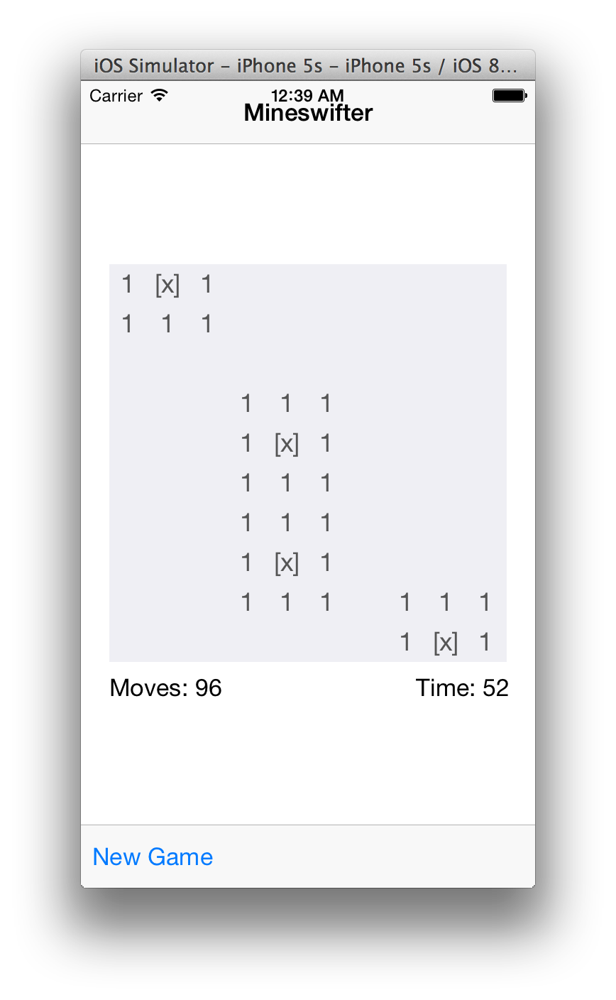
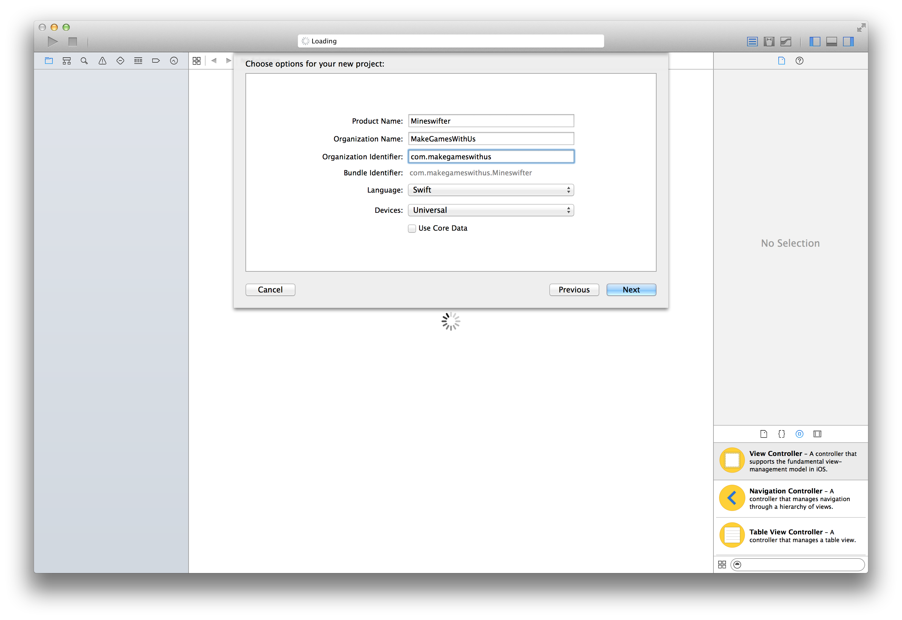
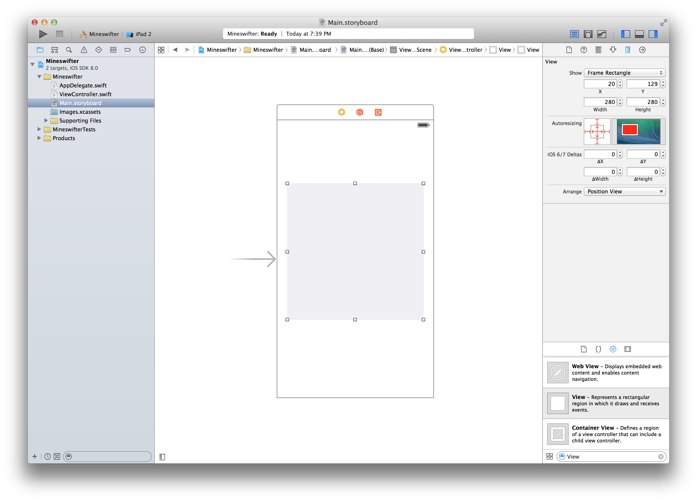
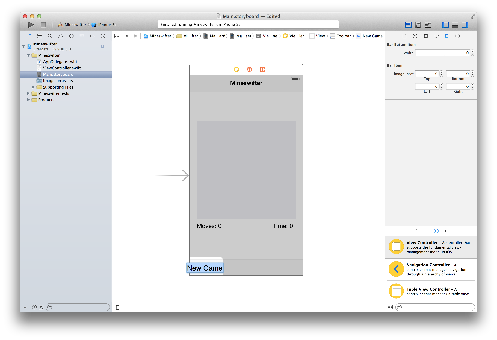
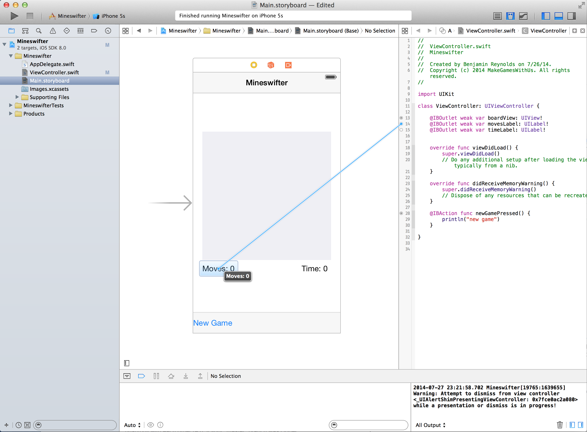
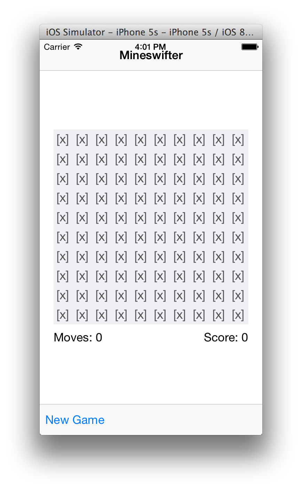
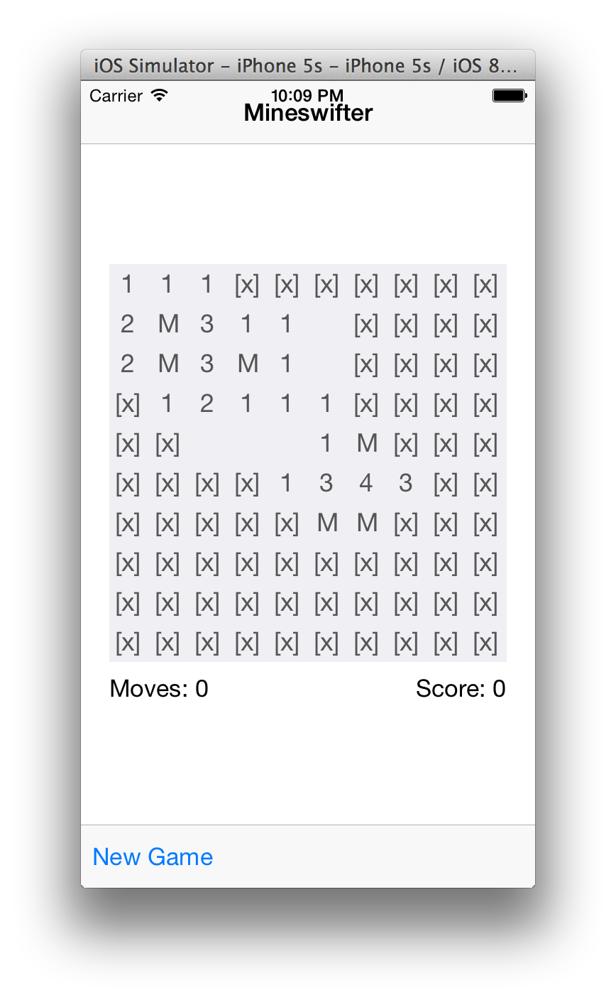
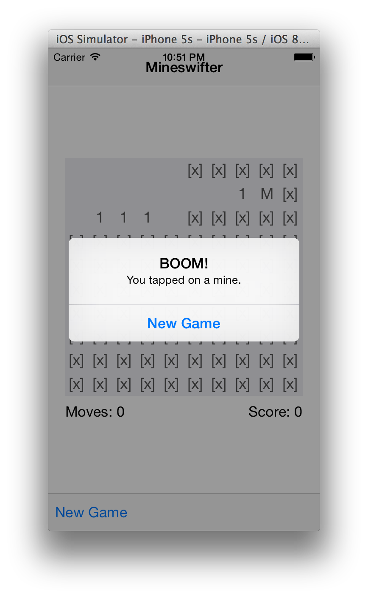
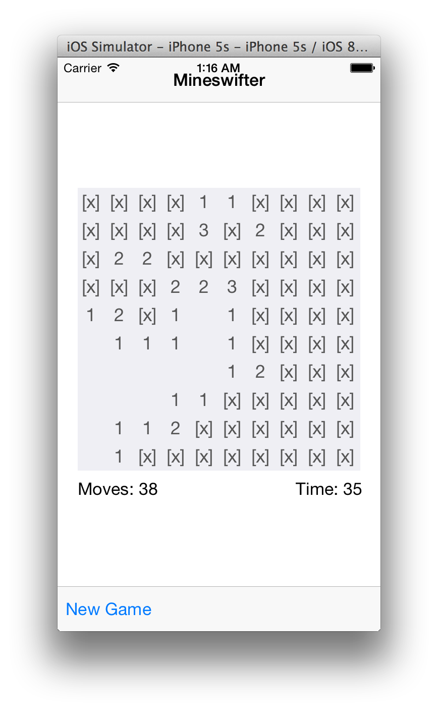
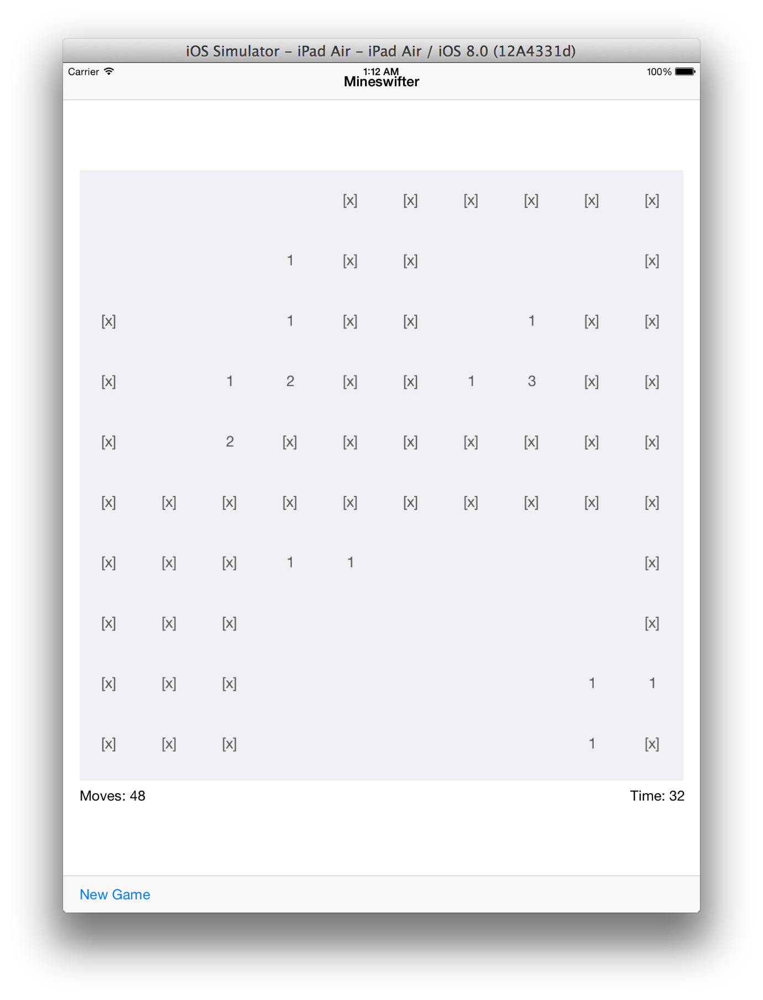

#1. Sample project: RedditSwift

Fetches JSON data from reddit to display a table view of a user's most recent reddit comments. Check out the source code to see how a working Swift App is structured. If you're a confident programmer and want to see how Swift works, this is the project for you.

Download the full source on [GitHub](https://github.com/MakeSchool/RedditSwift). You'll need Xcode 6 to build and run the app. Continue reading for a download link and additional resources.

#2. Step-by-Step tutorial: Mineswifter#

Want to learn Swift? This step-by-step introductory tutorial will show you how to build a minesweeper app from start to finish.

**Mineswifter: An Intro Tutorial to Swift iOS Development**

Build a Minesweeper game app using Swift &amp; Xcode’s Storyboard Interface Builder

We’re going to introduce building iOS apps using the Swift programming language by building a simple minesweeper game app. You’ll need to download the latest Xcode 6 version, to use the most recent version of the Swift language. You can find it in the App Store or you can download it by following the link on the [Swift Resources page](https://developer.apple.com/swift/resources/)

This tutorial will walk you through the creation of a Swift-powered iOS app; however, there are many aspects of learning Swift which are not explained here for the sake of brevity. At any point in this tutorial if you want to learn more about a particular part of the language, we recommend you refer to Apple's official iBook on Swift: [Download the Swift iBook](https://itunes.apple.com/us/book/the-swift-programming-language/id881256329?mt=11&amp;ls=1)

If you're unfamiliar with minesweeper, we recommend you read the overview: [Wikipedia article](http://en.wikipedia.org/wiki/Minesweeper_(video_game))

Source code can be found on [GitHub](https://github.com/MakeSchool/mineswifter-demo), and the final app will look like:

Open Xcode 6 Beta 4, then create a new project: File —&gt; New Project —&gt; iOS Single View Application —&gt; Language=“Swift”, Devices=“Universal”.

On the first screen that pops up, in the Deployment Info section of the General settings, uncheck the Landscape Left and Landscape Right orientations; this app should run in portrait only.

Let’s start by laying out the user interface using the Storyboard Interface Builder.

Open Main.storyboard, select the ViewController, on the screen (you may need to click on the top bar of the interface rather on the view itself to select the ViewController) and make sure the Utilities panel is open on the right (if not, click the button in the very top right of the Xcode window to pull it out). Now while the ViewController is selected, navigate to the File Inspector tab in this panel (the tab on the far left), and uncheck “Use Auto Layout”; if a pop-up appears, choose iPhone and then hit Disable Size Classes. Even though the app is Universal, we’re going to mainly design the interface for iPhone, but with a few modifications to make it iPad-compatible. We don’t need all the functionality of Auto-Layout, so to keep things simpler we just disable it.

Drag a “View” component (from the Object Library on the bottom right panel) onto the view controller. This view will hold our minesweeper board grid. In the attributes inspector, change background color to Group Table View Background Color, which is a subtle grey color.

In the Size inspector, set: X=20, Y=129, Width=280, Height=280, and make sure all the Autoresizing masks are turned on, so the view will resize on iPad (click the red lines in the Autoresizing inspector to turn them on).

Drag two new Label components onto the view controller, and align them beneath the board view; one up against the left edge and one on the right. Set the text of the label on the left to “Moves: 0” and the one on the right to “Time: 0”. Change the autoresizing masks of each label. Change the left one to align to the bottom left of the superview, and change the right one to align to the bottom right of the superview; this will make them look nice on iPad as well as iPhone. Also change the text alignment to right for the label on the right, so that it doesn’t trail off the edge of the screen as the text length increases.

Drag in a Navigation Bar component to the top of the view controller, and rename its title “Mineswifter”. We’ll simply use this as a static bar displaying the name of the app, but it could be used for navigation in a multi-page app.

Now drag a Toolbar component to the bottom of the view controller, and rename the “Item” button as “New Game”

That’s it for the interface, now let’s start coding. Open ViewController.swift. The first thing to do is to hook up the user interface we created in the Main.storyboard so that we can access the objects and have the New Game call a method.

Add IBOutlets to the class scope. These are properties that will connect to the components we added in the storyboard:

    @IBOutlet weak var boardView: UIView!
    @IBOutlet weak var movesLabel: UILabel!
    @IBOutlet weak var timeLabel: UILabel!

Now add an IBAction method that will get called when we press the new game button. For now it’ll just print to the console.

    @IBAction func newGamePressed() {
    	println("new game");
    }

Now go back to Main.storyboard, and open the Assistant editor (the tux like icon in the top right of Xcode) so you can view the ViewController.swift file at the same time. You’ll see an empty circle on the left margin of each line of code with an IBAction or IBOutlet — click on each and drag to the corresponding component in the Storyboard to make a connection.

Run your project now (Cmd+R), and it should compile correctly and display the view controller with the user interface you designed in the Storyboard. Click on the New Game button and you should see the print statement in the console (the bottom right of Xcode window, if you don't see the console you can toggle it on on the top right of xcode). If you choose a different device simulator, you can see it scales correctly between iPhone and iPad resolutions.

Now let’s really start coding. We’re going to follow the Model-View-Controller paradigm used frequently in iOS development, to separate the “front end” UI code from the “back end” model code.

Our backend model will be composed of two new classes; a Board.swift class and a Square.swift class. Lets start by creating Square.swift. File —&gt; New… File —&gt; Swift File —&gt; name=“Square.swift”

Define and implement this class, which is quite simple. It just needs to initialize and store the state of a given (row, column) cell within the board’s grid.

    class Square {
    	let row:Int
    	let col:Int
    	// give these default values that we will re-assign later with each new game
    	var numNeighboringMines = 0
    	var isMineLocation = false
    	var isRevealed = false
    	init(row:Int, col:Int) {
    		//store the row and column of the square in the grid
    		self.row = row
    		self.col = col
    	}
    }

Notice the different ways of declaring variables, the format of a method signature, and the assignment of of parameters to properties. Also notice that because we aren’t subclassing anything, we don’t even need to call super.init

Now that we’ve implemented the Square class, we can implement the board class, which represents a collection of squares and will provide methods for determining the number of neighboring mines a given square has.

File-&gt;New…File-&gt;Swift File-&gt;name=“Board.swift”

Board is slightly more compacted than Square. Start by defining the class, properties, and the init method:

    class Board {
    	let size:Int
    	var squares:[[Square]] = [] // a 2d array of square cells, indexed by [row][column]
    	init(size:Int) {
    		self.size = size
    	}
    }

Now add a double-for-loop to the init method to set up the grid of Square objects:

    for row in 0 ..< size {
    	var squareRow:[Square] = []
    	for col in 0 ..< size {
    		let square = Square(row: row, col: col)
    		squareRow.append(square)
    	}
    	squares.append(squareRow)
    }

Notice the syntax for for-loops ( using ..&lt; doesn’t include the upper bound, using … is inclusive). This creates a grid of Squares, but we still need to assign their isRevealed, isMineLocation, and numNeighborMines properties. We want to do this more than once; we want to reset these every time a new game is started. So let’s create a new method that we can call each time we start a new game:

    func resetBoard() {
    	// assign mines to squares
    	for row in 0 ..< size {
    		for col in 0 ..< size {
    			squares[row][col].isRevealed = false
    			self.calculateIsMineLocationForSquare(squares[row][col])
    		}
    	}
    	// count number of neighboring squares
    	for row in 0 ..< size {
    		for col in 0 ..< size {
    			self.calculateNumNeighborMinesForSquare(squares[row][col])
    		}
    	}
    }

This goes through all the squares, and sets their isRevealed property (whether they’ve been clicked on yet) to false. It then calls a method which will calculate their isMineLocation property. At the end, after all the mine locations have been assigned, we iterate through the squares again to count the number of neighboring mines for each. We’ll call the resetBoard method on the board from the ViewController class whenever we start a new game.

Let’s implement the calculateIsMineLocationForSquare method. It’s only one line of code, but separating it into its own method will make it easy to modify later if we change how we want to assign mines to squares. Right now it just randomly gives each square a mine with 10% probability:

    func calculateIsMineLocationForSquare(square: Square) {
    	square.isMineLocation = ((arc4random()%10) == 0) // 1-in-10 chance that each location contains a mine
    }

That was pretty simple, but calculateNumNeighborMinesForSquare is fairly complicated. We need to loop through each Square, and for each one, check the isMineLocation of each of its neighbors. Where it gets tricky is that the number of neighboring squares is different for certain squares; a square in the middle of the board is surrounded by 8 squares, but the squares on the corners only have 3 neighbors, etc.

To keep things clean, we’re going to break this into several methods:

    func calculateNumNeighborMinesForSquare(square : Square) {
    	// first get a list of adjacent squares
    	let neighbors = getNeighboringSquares(square)
    	var numNeighboringMines = 0
    	// for each neighbor with a mine, add 1 to this square's count
    	for neighborSquare in neighbors {
    		if neighborSquare.isMineLocation {
    			numNeighboringMines++
    		}
    	}
    	square.numNeighboringMines = numNeighboringMines
    }

This method relies on yet another method to provide a list of adjacent squares. After it gets that list, it isn’t hard to iterate through the list and check how many have mines

    func getNeighboringSquares(square : Square) -> [Square] {
    	var neighbors:[Square] = []
    	// an array of tuples containing the relative position of each neighbor to the square
    	let adjacentOffsets =
    		[(-1,-1),(0,-1),(1,-1),
    		(-1,0),(1,0),
    		(-1,1),(0,1),(1,1)]
    	for (rowOffset,colOffset) in adjacentOffsets {
    		// getTileAtLocation might return a Square, or it might return nil, so use the optional datatype "?"
    		let optionalNeighbor:Square? = getTileAtLocation(square.row+rowOffset, col: square.col+colOffset)
    		// only evaluates true if the optional tile isn't nil
    		if let neighbor = optionalNeighbor {
    			neighbors.append(neighbor)
    		}
    	}
    	return neighbors
    }

Notice the use of optional datatypes, which are a unique feature of Swift. By default variables can’t have nil values. If that’s a possibility, you must add a ? to the end of the datatype. To check if the value isn’t nil, we see if the assignment to a non-optional variable is successful.

Finally, implement the getTileAtLocation method to get tiles only if they are within the bounds of the board:

    func getTileAtLocation(row : Int, col : Int) -> Square? {
    	if row >= 0 && row < self.size && col >= 0 && col < self.size {
    		return squares[row][col]
    	} else {
    		return nil
    	}
    }

Great! Now our squares will correctly count the number of neighboring squares with mines (a value of 0-8 for each).

We’ve finished coding the “Model” of our Model-View-Controller paradigm. Let’s finish up the “View” by creating buttons to correspond with each Square in our board. Create a new file-&gt;Swift File-&gt;name=“SquareButton.swift”

This class is going to extend the UIButton class so that we can display it on the screen and tap it to call methods, so you need to import the UIKit framework:

    import UIKit
    class SquareButton : UIButton {
    }

Now start implementing the class by defining a few properties and then adding a custom init method that sets the size and the position of the button based on the associated square model. Add the following inside the SquareButton class:

    let squareSize:CGFloat
    let squareMargin:CGFloat
    var square:Square
    init(squareModel:Square, squareSize:CGFloat, squareMargin:CGFloat) {
    	self.square = squareModel
    	self.squareSize = squareSize
    	self.squareMargin = squareMargin
    	let x = CGFloat(self.square.col) * (squareSize + squareMargin)
    	let y = CGFloat(self.square.row) * (squareSize + squareMargin)
    	let squareFrame = CGRectMake(x, y, squareSize, squareSize)
    	super.init(frame: squareFrame)
    }
    required init(coder aDecoder: NSCoder) {
    	fatalError("init(coder:) has not been implemented")
    }

This calls the super.init(frame: CGRect) method to setup the UIButton such that it can be displayed properly on the screen. It calculates the x and y position based on the size of the square, the row and column, plus a small margin it adds between each

That’s all we need for now, although we’ll add another method later to help us change the button state upon clicking. For now, go back to ViewController.swift and let’s create a grid of buttons and add them to the screen using code. The ViewController class is the central “Controller” of our app which will communicate information from the Model to the View.

First define a new constant at the class level, to represent the number of rows and columns in our board. Using different values for this constant will adjust the gameplay, but lets start out with a board of size 10. Then add another property for the board itself:

    let BOARD_SIZE:Int = 10
    var board:Board

Now implement a custom init method that automatically gets called when the ViewController loads from the Storyboard, called init(coder aDecoder: NSCoder!). Add this to the class:

    required init(coder aDecoder: NSCoder)
    {
    	self.board = Board(size: BOARD_SIZE)
    	super.init(coder: aDecoder)
    }

We need that because our board property hasn’t been given a value yet, and it needs one by the time the init method finishes because it isn’t an optional variable so it can’t have a nil value.

We also need to define one more property: an array of SquareButton objects — our Board class already has a 2d array of all the Square model objects, but later on we’ll need a way to iterate through all the buttons themselves when we restart a new game to reset their appearances. Add this 1d array of SquareButtons to the class scope:

    var squareButtons:[SquareButton] = []

Now we have everything we need to initialize a new board and add the buttons to the screen. Implement the initializeBoard method to iterate through the board’s 2d array of Squares and add a button to the screen for each one:

    func initializeBoard() {
    	for row in 0 ..< board.size {
    		for col in 0 ..< board.size {
    			let square = board.squares[row][col]
    			let squareSize:CGFloat = self.boardView.frame.width / CGFloat(BOARD_SIZE)
    			let squareButton = SquareButton(squareModel: square, squareSize: squareSize);
    			squareButton.setTitleColor(UIColor.darkGrayColor(), forState: .Normal)
    			squareButton.addTarget(self, action: "squareButtonPressed:", forControlEvents: .TouchUpInside)
    			self.boardView.addSubview(squareButton)
    			self.squareButtons.append(squareButton)
    		}
    	}
    }

The line “squareButton.addTarget(self, action: “squareButtonPressed:", forControlEvents: .TouchUpInside)” will trigger a method called squareButtonPressed when we tap on any of these buttons. Let’s add a temporary implementation for that method so we can test the game. Add this function to ViewController.swift:

    func squareButtonPressed(sender: SquareButton) {
    	println("Pressed row:\(sender.square.row), col:\(sender.square.col)”)
    	sender.setTitle("", forState: .Normal)
    }

This will print to the console the row &amp; column of the button you tap on.

The initializeBoard method is a method that we only ever want to call once when the ViewController first loads. However, every time we start a new game we want to reset the board with new mine locations, and change the text on the buttons back to their default values. To do this, we’ll add a resetBoard method that we’ll call each time we want to start a new game (once when the view loads, and again each time we lose or press the New Game button). Add this method:

    func resetBoard() {
    	// resets the board with new mine locations & sets isRevealed to false for each square
    	self.board.resetBoard()
    	// iterates through each button and resets the text to the default value
    	for squareButton in self.squareButtons {
    		squareButton.setTitle("[x]", forState: .Normal)
    	}
    }

Now let’s add one small method that calls resetBoard, which we’ll add more code to later, called startNewGame:

    func startNewGame() {
    	//start new game
    	self.resetBoard()
    }

Finally, find the default viewDidLoad method in the ViewController class, and add to the end of the method:

    self.initializeBoard()
    self.startNewGame()

Alright, now Build and Run the game by pressing Cmd+R, and you should see a 10x10 grid of buttons “[x]” as their labels! Tapping on them will clear the “[x]” text on their title labels, and will print their position to the console.

That’s great and all, but it’s not a minesweeper game yet. One thing we can do to make it a lot closer to a finished minesweeper game is to make the buttons display different text when you click on them depending on their isMineLocation and numNeighboringMines properties. Replace the body of the squareButtonPressed method with the following:

    if(!sender.square.isRevealed) {
    	sender.square.isRevealed = true
    	sender.setTitle("\(sender.getLabelText())", forState: .Normal)
    }

This will reveal the contents of a square upon tapping it, only if you haven’t previously done so. To determine what to display on the squareButton, it calls a method on the squareButton asking for the new text. We haven’t implemented this yet, so let’s open the SquareButton.swift file and add getLabelText:

    func getLabelText() -> String {
    	// check the isMineLocation and numNeighboringMines properties to determine the text to display
    	if !self.square.isMineLocation {
    		if self.square.numNeighboringMines == 0 {
    			// case 1: there's no mine and no neighboring mines
    			return ""
    		}else {
       			// case 2: there's no mine but there are neighboring mines
        			return "\(self.square.numNeighboringMines)"
    		}
    	}
    	// case 3: there's a mine
    	return "M"
    }

If you Build and Run the app again, you’ll see that tapping on the buttons changes their text to show a number if they have any neighboring mines, nothing if they have no neighboring mines, or an “M” if they contain a mine.

One quick feature we can finish up is making the New Game button start a new game. This is really simple; just call startNewGame in the newGamePressed method we defined earlier. It should now look like this:

    @IBAction func newGamePressed() {
    	println("new game")
    	self.startNewGame()
    }

If you test the app, clicking the button will reset all the square buttons and randomize the mine locations.

Now let’s make the game end when the user taps on a mine. We can make an alert pop up when this happens, with a button to reset the game. Add this conditional to the bottom of squareButtonPressed:

    if sender.square.isMineLocation {
    	self.minePressed()
    }

Now let’s implement minePressed to show an alert.

    func minePressed() {
    	// show an alert when you tap on a mine
    	var alertView = UIAlertView()
    	alertView.addButtonWithTitle("New Game")
    	alertView.title = "BOOM!"
    	alertView.message = "You tapped on a mine."
    	alertView.show()
    }

Tapping on the New Game button on this alert will dismiss the alertView, but it won’t actually start a new game yet. Add the following method to start a new game when any button on an alertView is pressed:

    func alertView(View: UIAlertView!, clickedButtonAtIndex buttonIndex: Int) {
    	//start new game when the alert is dismissed
    	self.startNewGame()
    }

This won’t quite work yet, because we haven’t told the alertView that the ViewController class is going to handle this dismissing interaction. To do so, we need to tell the alertView to pass on (“to delegate”) this interaction to the ViewController. We do this by setting the delegate property of the alertView; add this to the bottom of the minePressed method:

    alertView.delegate = self

Now when you tap New Game on the alertView, the board will reset and you can try again.

The core gameplay is now mostly finished; lets add properties for the number of moves taken, and the time that has passed since the beginning of each game. Add these properties to the ViewController class scope, including didSet methods for each:

    var moves:Int = 0 {
    	didSet {
    		self.movesLabel.text = "Moves: \(moves)"
    		self.movesLabel.sizeToFit()
    	}
    }
    var timeTaken:Int = 0  {
    	didSet {
    		self.timeLabel.text = "Time: \(timeTaken)"
    		self.timeLabel.sizeToFit()
    	}
    }

The didSet methods get triggered whenever the value of the properties are changed, so we use them to automatically update the display of the corresponding labels. The sizeToFit will adjust the size of the label to fit the text inside it as the text length increases. Now add to the bottom of the startNewGame method to reset these variables each time you start a new game:

    func startNewGame() {
    	//start new game
    	self.resetBoard()
    	self.timeTaken = 0
    	self.moves = 0
    }

Now we just need a way to update these variables as the game progresses. The moves property is easy; just increment by one every time a new button is tapped. Add this inside the (!sender.square.isRevealed) conditional in the squareButtonPressed method:

    self.moves++

The time is a bit more complicated, because we need to create a timer object to trigger a method every one second. Define this new property on the class:

    var oneSecondTimer:NSTimer?

We make it an optional NSTimer object because that allows us to give it a nil value after one game ends but before another begins. Add the following line to the end of startNewGame to create a new timer:

    self.oneSecondTimer = NSTimer.scheduledTimerWithTimeInterval(1.0, target: self, selector: Selector("oneSecond"), userInfo: nil, repeats: true)

This will call a method named “oneSecond” every 1.0 seconds. Let’s define that method to increase the time by 1 each time it is called:

    func oneSecond() {
    	self.timeTaken++
    }

Playing now will update the Time and Moves labels appropriately. There’s one problem: the timer keeps going up even if you lose a game, and with each new game it schedules a new timer without invalidating the old one, so with each game you play the time goes up faster and faster. Add a new method that we can trigger whenever we end a game; either by tapping on a mine or the New Game button:

    func endCurrentGame() {
    	self.oneSecondTimer!.invalidate()
    	self.oneSecondTimer = nil
    }

Notice that because oneSecondTimer is an optional, we have to put a ! at the end of its name to access its properties; this exclamation point asserts that the object is not nil at the current time, so it’s fine to access as a non-optional.

Add to the top of the minePressed method:

    self.endCurrentGame()

And add to the top of the newGamePressed method:

    self.endCurrentGame()

If you run the app now, it should handle the timer properly in new games. Congratulations! You’ve built an app using the Swift programming language, and Xcode’s Storyboarding interface builder.

One neat feature that we’ve built in is cross-compatibility between the iPhone and the iPad, because the positioning of the square buttons is based on the size of the boardView, which scales to fill the screen width. Check out the iPhone and the iPad versions:

There are many features you can add to this app if you want an extra challenge. Here are a few ideas:

*   Add a new user interface component to change the difficulty of new games - you can adjust the calculateIsMineLocationForSquare method in Board.swift to change the difficulty.
*   Implement an algorithm to clear multiple squares at the same time if you click on a square with no neighboring mines. It should continue to clear neighboring squares with no neighboring mines, as seen in traditional minesweeper games.
*   Let the player know when they’ve won the game, which happens when they’ve revealed every non-mine tile on the board without tapping any mines.
