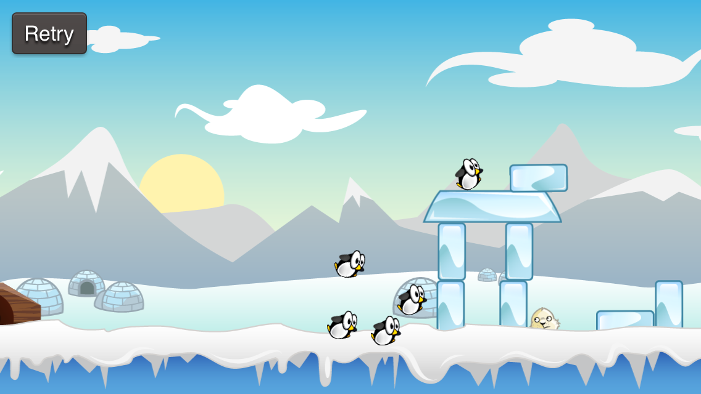

Inspired by this interesting [question on StackOverflow](http://stackoverflow.com/questions/21593519/how-to-make-a-dynamic-body-static-in-cocos2d-v3-0-with-chipmunk/21606421#21606421) I want to show you a short example how to work with advanced physics features in Cocos2d 3.0. This will give you an idea of what can be done with the new integrated physics engine *Chipmunk*.

## Q: How can I turn a dynamic physics body into a static body upon collision, to make the object stick to a surface?

##1. Import a new header file

First of all it is important to know, that not all Chimpunk features are exposed through Cocos2d classes like *CCPhysicsNode* and *CCPhysicsBody*. For some more advanced features you need to use the actual [Objective-Chipmunk API](https://chipmunk-physics.net/release/Chipmunk-5.x/Objective-Chipmunk-5.3.5-Docs/index.html).

In Cocos2d 3.0 you need to import a special header to get access to the underlying Chipmunk objects contained in *CCPhysicsNode* and *CCPhysicsBody:*

    #import "CCPhysics+ObjectiveChipmunk.h"

##2. Add a post-step callback

As the StackOverflow question states, it is not simply possible to change the bodyType from dynamic to static in the collision handler. The problem is, that the collision handler is called while Chipmunk is calculating a physics *step*. During a calculation of a *step* collisions are resolved and objects are moved around. Chipmunk locks the Chipmunk Space of the *CCPhysicsNode* during this calculation because changing the body or removing objects while calculating the impact of collisions can result in unexpected behaviour.

You can however change the bodyType of a *CCPhysicsNode* **after** the *step* calculation completed. To do so you need to add a post-step callback. I have implemented this in a branch of our [SpriteBuilder Tutorial](https://www.makeschool.com/tutorials/getting-started-with-spritebuilder/):

    - (void)ccPhysicsCollisionPostSolve:(CCPhysicsCollisionPair *)pair penguin:(CCNode *)penguin wildcard:(CCNode *)nodeB
    {
        if (nodeB == _catapultArm) {
            // penguin shall not stick to catapultArm
            return;
       }
        float energy = [pair totalKineticEnergy];
        // if energy is large enough, make penguin static
        if (_currentPenguin.launched && (energy > 10000.f))
        {
            [[_physicsNode space] addPostStepBlock:^{
    		penguin.physicsBody.type = CCPhysicsBodyTypeStatic;
    	} key:penguin];
        }
    }

Whenever a penguin collides with a high velocity I turn it into a static physics body. The most interesting lines are these:

    [[_physicsNode space] addPostStepBlock:^{
         penguin.physicsBody.type = CCPhysicsBodyTypeStatic;
    } key:penguin];

Through the header we imported earlier we have access to the *ChipmunkSpace* of our physics node. This is where we add the *postStepBlock.* That block is executed when Chipmunk completed the s*tep* calculation. Within this block we change the type of the physics body to static.

The *key* value you pass into the callback is used to ensure that the callback is only called once. This is especially important when removing objects, but it also makes sense in this case, because we don't want to change the body type multiple times.

With this implementation penguins get stuck to surfaces (or in the air, when the ice blocks fall to the ground) when they collide intensely with other physics objects:

You can check out the implementation on [GitHub](https://github.com/MakeSchool/PeevedPenguins-Spritebuilder/tree/change-chipmunk-bodytype)!

Happy coding!

benji@makeschool.com
