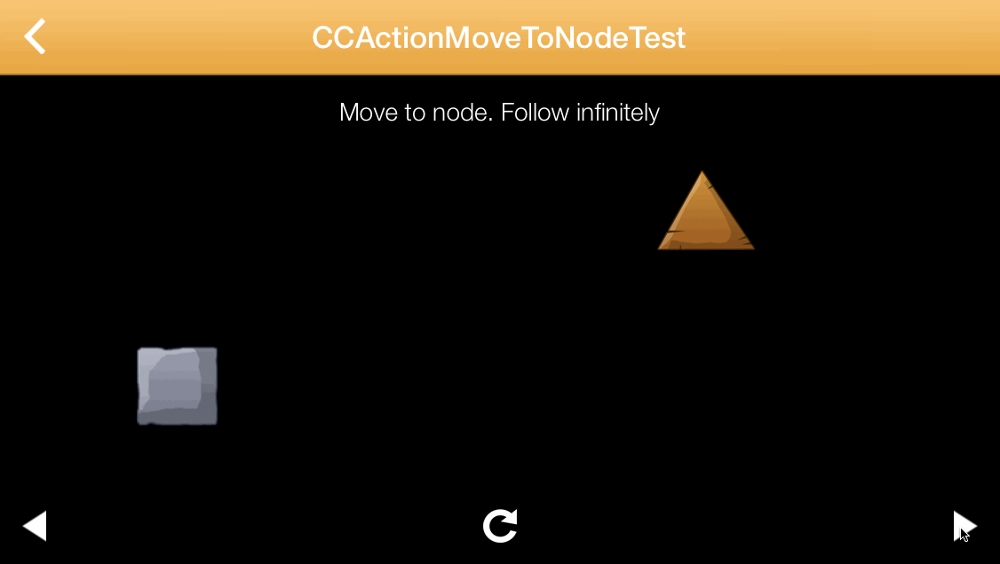

Many games require two objects to follow each other, or one object moving to a moving target. Until now you had to implement this mechanism manually. Today we're releasing a new CCAction for Cocos2d 3.0 that makes this a lot simpler, **CCActionMoveToNode:**

# Usage

## Move to a Node

    CCActionMoveToNode *moveTo = [CCActionMoveToNode actionWithSpeed:100.f targetNode:_spriteToFollow];
    [_followingSprite runAction:moveTo];

## Follow a Node infinitely

    CCActionMoveToNode *moveTo = [CCActionMoveToNode actionWithSpeed:100.f targetNode:_spriteToFollow followInfinite:YES];
    [_followingSprite runAction:moveTo];

## Get informed when target node is reached

    moveTo.actionCompletedBlock = ^(void) {
        [self.contentNode addChild:completedLabel];
    };

## Provide the target position through a block

   Assuming you want to follow a certain position within a target node you also have the possibility to provide the target position through a block:

    CCActionMoveToNode *moveTo = [CCActionMoveToNode actionWithSpeed:100.f positionUpdateBlock:^CGPoint{
        return _spriteToFollow.position;
    }];
    [_followingSprite runAction:moveTo];

# A lot more options!

Checkout the code on [GitHub](https://github.com/MakeSchool/CCActionMoveToNode). It contains many tests with all kinds of examples how this API can be used.

Have fun with it!

benji@makeschool.com
