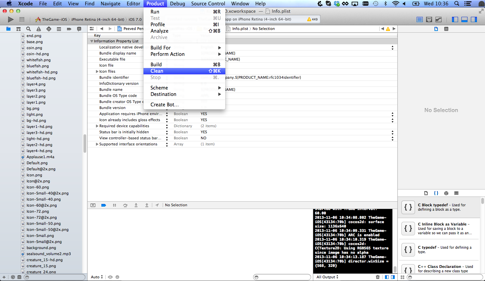

A lot of us iOS game developers have switched to the iPhone 5 / iPhone 5S / iPhone 5C, however there are still a lot old devices on the market only supporting the 320x480 screen size. Thus we are still building games that support these old dimensions.

Today an important question came up, since most of us do not have devices of both screen sizes available: **How can I test my game on a iPhone 5 as if it was running on an iPhone 4?**

You have to remove the iPhone 5 launch image. That will force your app to run in letterbox mode and only using the screen size available on the iPhone 4.

# Step by Step

1.  Locate the file "Default-568h@2x.png" (this is your iPhone 5 Splashscreen) and select *Delete*
    

2.  Select *Remove Reference* since we want to re-add the image later on, once we are finished with testing

    

3.  Clean the project:

    

4.  Delete the app from your device:

    

5.  **Build your app on your device again.**
6.  Test your App in letterbox mode:

    

7.  Once you are done, add the "Default-568h@2x.png" to your project again.

If you have any issues with this - please don't hesitate to contact me: benji@makeschool.com

Happy Coding!

*You want to learn how to build and ship your own iPhone game? You want to gain industry relevant skills? Join us next summer @ the [MakeSchool Summer Academy](https://www.makeschool.com/summer-academy)!*
